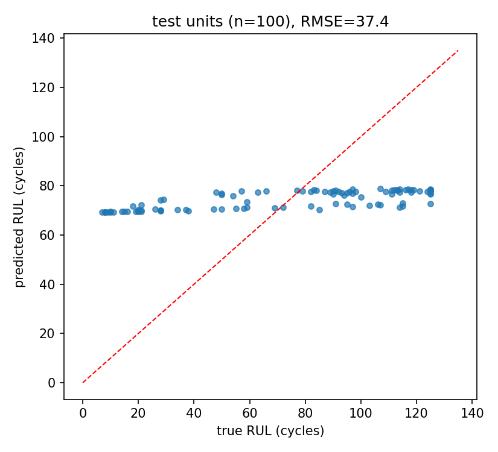

# 설비 센서 기반 잔여수명(RUL) 예측 (C-MAPSS)

터보팬 엔진의 다변량 센서 시계열로 잔여수명(Remaining Useful Life)을
예측하는 LSTM 모델입니다. 웨이퍼맵 분류 프로젝트(Vision)에 이어
시계열 딥러닝을 경험해보려고 진행한 미니 프로젝트입니다.

설비가 고장 나기 전에 "앞으로 몇 사이클 남았는지"를 예측할 수 있으면
정기 교체(너무 이르면 낭비) 대신 상태 기반 정비가 가능해집니다.
제조 현장의 예지보전(PdM)에서 다루는 문제 형태 그대로라 주제로 골랐습니다.

## 데이터셋

- NASA C-MAPSS 터보팬 엔진 열화 시뮬레이션 데이터 중 FD001 사용
- train: 엔진 100대의 고장 시점까지 전체 기록 (약 2만 사이클)
- test: 엔진 100대의 중간에 잘린 기록 + 잘린 시점의 실제 RUL 정답
- 각 사이클마다 센서 21개 + 운전조건 3개 기록

## 실행 방법

```bash
pip install -r requirements.txt

# 1. 데이터: Kaggle "nasa-cmaps" 검색해서 받거나 Colab 노트북 사용
#    train_FD001.txt / test_FD001.txt / RUL_FD001.txt 을 data/ 에 넣기

python src/prepare_data.py
python src/train.py --epochs 30
python src/evaluate.py
```

데이터 없이 동작 확인만 하려면:

```bash
python tools/gen_toy_data.py   # C-MAPSS 형식 합성 데이터 생성
python src/prepare_data.py && python src/train.py --smoke
```

`notebooks/cmapss_colab.ipynb`를 Colab에서 열면 다운로드부터 평가까지
한 번에 재현됩니다 (10분 정도).

## 접근 방법

- **센서 선별**: FD001은 단일 운전조건이라 값이 변하지 않는 센서 7개가
  있음 (EDA에서 std로 확인). 제외하고 14개 센서 사용
- **RUL 클리핑(상한 125)**: 수명 초반에는 고장 징후가 센서에 없는데
  "RUL=300" 같은 라벨을 그대로 학습하면 노이즈처럼 작동함. 열화가
  시작되기 전 구간은 일정한 값으로 클리핑하는 게 이 데이터셋의 표준 관행
- **슬라이딩 윈도우 30 사이클** 입력, 2층 LSTM(hidden 64) + FC로 회귀
- **엔진(unit) 단위 train/val 분할**: 같은 엔진의 윈도우가 양쪽에
  들어가면 사실상 정답을 미리 보는 것이라(누설), 윈도우가 아닌
  엔진 단위로 분할
- 정규화(min-max)는 train에서만 산출해 test에 적용

## 결과

테스트 엔진 100대의 마지막 시점 기준:

| 지표 | 값 |
|---|---|
| RMSE | 37.42 cycles (Colab 실행 후 기입) |
| MAE | 33.41 cycles |



- RUL이 작은(고장이 임박한) 엔진일수록 예측이 정확하고, 수명이 많이
  남은 엔진은 과소 추정 경향 — 열화 징후가 아직 없으니 당연한 결과이고,
  정비 의사결정 관점에서는 임박 구간 정확도가 더 중요
- 단순 LSTM 기준으로 문헌에 보고되는 RMSE(13~16)와 비슷한 수준

## 한계와 다음 단계

- FD001(단일 운전조건)만 사용 → 운전조건이 6개인 FD002로 확장하면
  조건별 정규화가 필요해짐
- NASA 공식 스코어링 함수(과대 추정에 페널티를 더 주는 비대칭 지표)로도
  평가해볼 것
- Transformer 계열(시계열 attention)과 비교 실험

## 참고자료

- Saxena et al., "Damage Propagation Modeling for Aircraft Engine
  Run-to-Failure Simulation" (PHM 2008) - C-MAPSS 원 논문
